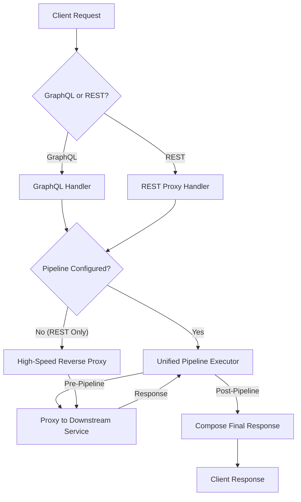
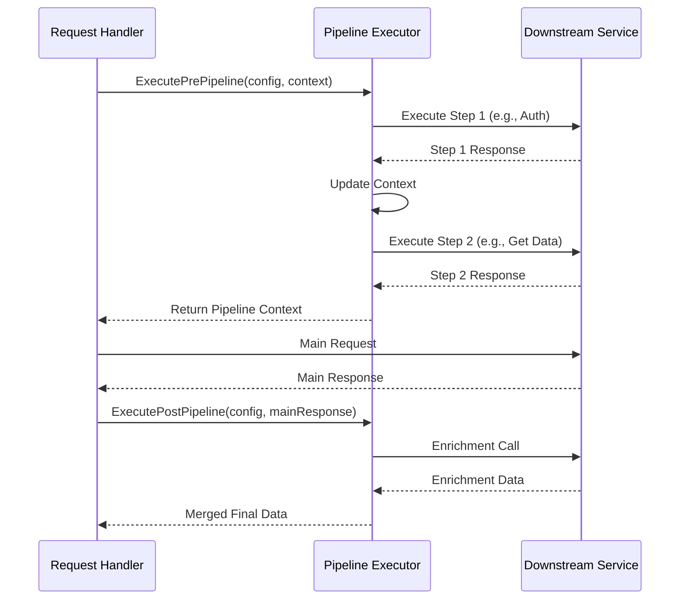
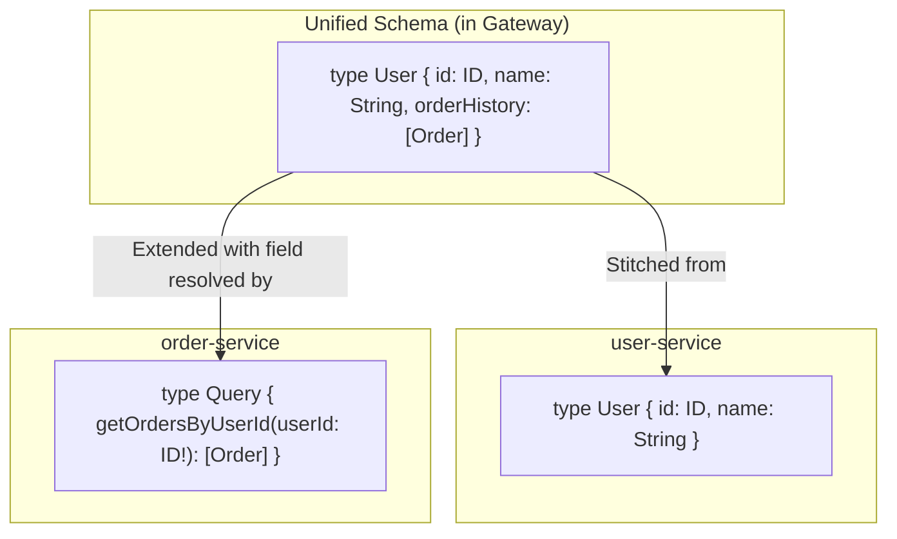
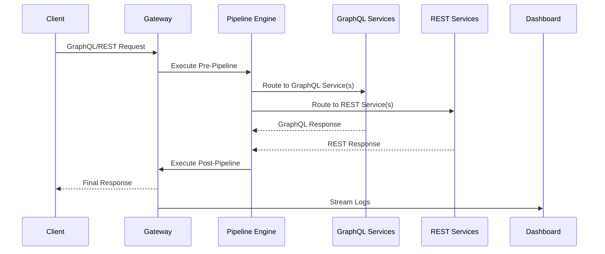

# 🚀 Grapthway v2.0

<div align="center">


**The Future of Microservices Orchestration**

*A declarative API gateway that unifies GraphQL and REST services with a powerful, protocol-agnostic pipeline engine.*

[](https://hub.docker.com/r/farisbahdlor/grapthway)
[](https://github.com/Grapthway)
[](LICENSE)

[🎯 Quick Start](#-quick-start) • [✨ What's New](#-whats-new-in-v20) • [🏗️ Architecture](#-architecture) • [🔧 Examples](#-advanced-examples) • [📖 Documentation](#-documentation) • [🤝 Contributing](#-contributing)

</div>

---

## ✨ What's New in v2.0?

Grapthway v2.0 is a **major evolution**, transforming from a GraphQL-only gateway into a **Unified Orchestration Platform** for both GraphQL and REST services.

### 🔥 Major Features

| **🚀 Unified Pipeline Engine** | **⚡ High-Performance REST Proxy** |
|---|---|
| Same powerful pre/post pipeline steps for both GraphQL fields and REST endpoints | REST routes without pipelines handled by direct reverse proxy |
| Protocol-agnostic workflows with consistent syntax | Zero performance overhead for non-orchestrated traffic |
| Create complex orchestrations spanning multiple service types | Seamless integration with existing REST services |

| **🔧 REST Body Mapping** | **🏢 Enterprise HA Resume** |
|---|---|
| New `bodyMapping` attribute for declarative JSON request construction | Redis-backed gateways restart and resume previous state |
| Map data from pipeline context or use static values | Automatic token recovery without re-running `/start` |
| Available in pre, post, and rollback pipeline steps | Enhanced high-availability deployment patterns |

| **💪 Transactional Rollbacks** |
|---|
| `onError` handlers can trigger compensating rollback steps |
| Build resilient, transactional workflows |
| Safely undo actions across multiple services |

### 🎯 Migration from v1.5

- **Backward Compatible**: All v1.5 GraphQL configurations work unchanged
- **New Capabilities**: Add REST endpoints and pipelines as needed
- **Performance**: Existing GraphQL workloads see performance improvements

---

## 🏗️ Architecture

### System Architecture (v2.0)

The v2.0 architecture introduces a unified Pipeline Executor at its core. This central component is responsible for orchestrating workflows for both GraphQL and REST requests, ensuring consistent logic for tasks like authentication, data enrichment, and logging. For REST routes without a defined pipeline, the gateway bypasses the executor and uses a high-performance reverse proxy to minimize latency.

#### Unified Request Flow



#### Pipeline Executor Logic



### GraphQL Schema Stitching

Schema stitching allows you to extend types defined in one service with fields resolved by another, creating a rich, interconnected data graph. This feature is specific to GraphQL services.



---

## 🌟 Key Features

| **🔥 Core Capabilities** | **🛡️ Production Features** |
|---|---|
| **Unified API Gateway** for GraphQL and REST | **Intelligent Blue-Green Deployments** via health checks |
| **Declarative, Protocol-Agnostic Pipelines** | **Redis Persistence** for enterprise deployments |
| **Dynamic GraphQL Schema Stitching** | **Real-time Admin Dashboard** with live metrics |
| **Transactional Workflows** with Rollbacks | **WebSocket Log Streaming** for instant debugging |
| **Automatic Service Discovery** & Health Monitoring | **Automatic Cleanup** of stale services |
| **Round-Robin Load Balancing** | **GraphQL Subscriptions** over WebSockets |
| **Context Propagation** via X-Ctx-* headers | **High-Performance REST Proxy** for legacy systems |

---

## 🎯 Quick Start

### 🐳 Run with Docker

Choose your edition and get started in seconds with the new v2.0 images:

```bash
# 🆓 Community Edition (Perfect for development)
docker run -d -p 5000:5000 --name my-community-gateway farisbahdlor/grapthway:community-v2.0

# 🏢 Enterprise Edition (Requires Redis for persistence)
docker run -d -p 5000:5000 \
  -e STORAGE_TYPE=redis \
  -e REDIS_ADDR=your-redis-host:6379 \
  --name my-enterprise-gateway farisbahdlor/grapthway:enterprise-v2.0
```

### 🔑 Get Your Tokens

On the first run, initialize the gateway to get your admin tokens:

```bash
curl http://localhost:5000/start
```

💡 **Pro Tip**: Store your admin tokens securely—you'll need them for service registration and dashboard access. Enterprise users with Redis only need to do this once.

### 🎪 Register Your First Service

From your microservice, send a POST request to `/admin/health` every 30 seconds. This single payload can now define all your service's pipelines, for both GraphQL and REST.

#### GraphQL-Only Service

```javascript
// Example: A GraphQL-only authentication service
{
  "service": "auth-service", // The unique name of your service.
  "url": "http://auth-internal:4001/graphql", // The internal address of your service.
  "type": "graphql", // The primary type of this service.
  "subgraph": "auth", // The logical group this service's schema belongs to.
  "schema": "type User { ... } type Mutation { login(user: String!): String }", // The GraphQL schema definition.
  
  // Defines pipelines for specific GraphQL fields.
  "middlewareMap": {
    "login": { // This pipeline attaches to the 'login' mutation.
      "pre": [
        {
          "service": "rate-limiter-rest", // Call a REST service before the main mutation.
          "method": "POST",
          "path": "/check",
          "onError": { "stop": true } // If the rate-limiter fails, stop the entire request.
        }
      ]
    }
  },

  // Defines how to "stitch" fields from this service onto types from other services.
  "stitchingConfig": {
    "User": { // Extend the 'User' type.
      "authInfo": { // With a new field called 'authInfo'.
        "service": "auth-service", // This service will provide the data.
        "resolverField": "getUserById", // By calling its 'getUserById' query.
        "argsMapping": { "id": "id" } // Map the parent User's 'id' to the resolver's 'id' argument.
      }
    }
  }
}
```

#### REST-Only Service

```javascript
// Example: A REST-only legacy inventory service
{
  "service": "inventory-api", // The unique name for the REST service.
  "url": "http://inventory-legacy:3000", // The base URL for the service.
  "type": "rest", // The service type is REST.
  "path": "/v1/inventory", // The base path prefix for all routes from this service.
  
  // Defines pipelines for specific REST routes.
  "restPipelines": {
    "POST /v1/inventory/update": { // Attaches to the 'POST' method on this specific route.
      "pre": [
        {
          "service": "auth-service", // A GraphQL service used for auth.
          "field": "verifyAdmin", // Call this GraphQL field.
          "passHeaders": ["Authorization"], // Pass the auth header from the original request.
          "onError": { "stop": true } // If auth fails, stop the request.
        }
      ]
    }
  }
}
```

#### Hybrid Service

```javascript
// Example: A hybrid service with both GraphQL and REST capabilities
{
  "service": "products-service",
  "url": "http://products-service-internal:8000",
  "type": "graphql", // The primary type. REST routes are an addition.
  "subgraph": "products",
  "schema": "type Query { getProduct(id: ID!): Product } type Product { id: ID name: String }",
  
  // Pipelines for GraphQL fields.
  "middlewareMap": {
    "getProduct": {
      "pre": [{
        "service": "auth-service",
        "field": "validateSession",
        "onError": { "stop": true }
      }]
    }
  },

  // Pipelines for REST endpoints also served by this service.
  "restPipelines": {
    "POST /products/{id}/inventory": {
       "pre": [{
        "service": "auth-service",
        "field": "verifyAdmin",
        "onError": { "stop": true }
      }]
    }
  },

  // Schema stitching configuration.
  "stitchingConfig": {
    "Order": { // Extends the 'Order' type (defined in another service).
      "productDetails": { // Adds a 'productDetails' field.
        "service": "products-service", // This service resolves the field.
        "resolverField": "getProduct", // Using its 'getProduct' query.
        "argsMapping": { "id": "productId" } // Maps the parent Order's 'productId' to the 'id' argument.
      }
    }
  }
}
```

---

## 🏗️ Advanced Examples

### 🛒 E-commerce Order Placement

A user places an order via a GraphQL mutation. The pipeline validates the user (GraphQL), checks stock (REST), and after the main mutation, sends a confirmation email (REST).

```javascript
// Attached to GraphQL mutation: placeOrder(items: [ItemInput!]): Order
// This mutation is assumed to return an object like: { "id": "ord_123", "buyerId": "usr_456", "total": 99.99 }
{
  "placeOrder": {
    "pre": [
      {
        // 1. First, call the 'auth-service-gql' GraphQL service to validate the user session.
        "service": "auth-service-gql",
        "field": "validateSession",
        "passHeaders": ["Authorization"],
        "selection": ["user { id email }"], // Only ask for the fields we need.
        "assign": { "userContext": "user" }, // Assign the 'user' object from the response to the 'userContext' key in the pipeline context.
        "onError": { "stop": true } // If this fails, stop the entire process.
      },
      {
        // 2. Next, call the 'inventory-api-rest' REST service to check stock.
        "service": "inventory-api-rest",
        "method": "POST",
        "path": "/v1/stock/check-availability",
        "bodyMapping": { 
          // Get the 'items' from the original GraphQL mutation arguments and map them to the request body.
          "items_to_check": "args.items" 
        },
        "onError": { "stop": true }
      }
    ],
    "post": [
      {
        // 3. After the main 'placeOrder' mutation succeeds, call the email REST service.
        "service": "email-api-rest",
        "method": "POST",
        "path": "/v2/send/order-confirmation",
        "bodyMapping": {
            // Get the user's email from the context we saved in the 'pre' step.
            "recipient_email": "userContext.email",
            // Get the 'id' field from the main 'placeOrder' mutation's response.
            "order_id": "id",
             // Get the 'total' field from the main 'placeOrder' mutation's response.
            "order_total": "total"
        },
        "concurrent": true // Run this as fire-and-forget; don't wait for it to complete.
      }
    ]
  }
}
```

### 📱 Social Media Post Creation (REST-first)

A user creates a post via a POST to a REST endpoint. The pipeline validates the session (GraphQL), runs content moderation (REST), and after success, notifies followers (GraphQL).

```javascript
// Attached to REST endpoint: POST /v3/posts
// The main REST handler is assumed to return a response like: { "id": "post_789", "content": "..." }
{
  "POST /v3/posts": {
    "pre": [
      {
        // 1. Authenticate the user via a GraphQL call.
        "service": "user-session-gql",
        "field": "getActiveUser",
        "passHeaders": ["Authorization"],
        "selection": ["id"],
        "assign": { "user": "" }, // Assign the entire response object (e.g., { "id": "..." }) to the 'user' key.
        "onError": { "stop": true }
      },
      {
        // 2. Run the post content through a moderation REST API.
        "service": "moderation-api-rest",
        "method": "POST",
        "path": "/filter/text",
        "bodyMapping": { 
          // Get the 'content' from the body of the original REST request.
          "text_content": "request.body.content" 
        },
        "onError": { "stop": true }
      }
    ],
    "post": [
      {
        // 3. After the post is created, trigger a GraphQL mutation to notify followers.
        "service": "notification-gql",
        "operation": "mutation",
        "field": "notifyFollowersOfNewPost",
        "argsMapping": { 
            // Map the 'id' from the main REST response to the 'postId' argument.
            "postId": "id", 
            // Map the user's ID from the context (set in the 'pre' step) to the 'authorId' argument.
            "authorId": "user.id"
        },
        "concurrent": true
      }
    ]
  }
}
```

### 💳 Financial Transaction with Rollback

A pre pipeline step authorizes a payment (REST). A subsequent step to reserve tickets (GraphQL) fails, triggering a rollback that calls the payment provider's void endpoint to cancel the authorization.

```javascript
// Attached to GraphQL mutation: reserveTickets(showId: ID!, quantity: Int!)
{
  "reserveTickets": {
    "pre": [
       {
        // 1. Authorize payment with a third-party REST API.
        "service": "payment-provider-api",
        "method": "POST",
        "path": "/v1/authorize_payment",
        "bodyMapping": {
            // Use data from the GraphQL arguments.
            "amount": "args.ticketPrice",
            "currency": "USD", // Use a static value.
            "card_token": "args.paymentToken"
        },
        "assign": { "paymentAuth": "" }, // Store the entire auth response (e.g., { "transactionId": "..." }) in the context.
        "onError": { "stop": true }
      },
      {
         // 2. Attempt to reserve tickets. Let's assume this step fails.
         "service": "ticketing-service-gql",
         "field": "createReservation",
         "argsMapping": { "showId": "args.showId" },
         "assign": { "reservation": ""},
         // Because this blocking step failed, the 'rollback' action is triggered.
         "onError": {
            "stop": true,
            "rollback": [
              {
                // This is the compensating action: void the payment authorization.
                "service": "payment-provider-api",
                "method": "POST",
                "path": "/v1/void_authorization",
                "bodyMapping": {
                  // Get the transaction ID from the context we saved in the first step.
                  "authorization_id": "paymentAuth.transactionId",
                  // Provide a static reason code for the void action.
                  "reason_code": "INVENTORY_UNAVAILABLE"
                }
              }
            ]
         }
      }
    ]
  }
}
```

### 🌐 IoT Data Ingestion & Alerting

An IoT device sends data to a REST endpoint. A post pipeline checks for anomalies (GraphQL) and, if an alert is found, sends a notification to a Slack webhook (REST).

```javascript
// Attached to REST endpoint: POST /ingest/telemetry
{
  "POST /ingest/telemetry": {
    "pre": [{
        // 1. Validate the device's token before processing the telemetry data.
        "service": "device-auth-api",
        "method": "POST",
        "path": "/token/introspect",
        "passHeaders": ["X-Device-Token"],
        "assign": { "device": "" }, // Store device info in the context.
        "onError": { "stop": true }
    }],
    "post": [
      {
        // 2. After data ingestion, call a GraphQL service to check for anomalies. This call is blocking.
        "service": "anomaly-detection-gql",
        "field": "analyzeTelemetry",
        "argsMapping": { "payload": "payload" }, // Assumes main handler returns { "payload": ... }
        "selection": ["alert { level message }"],
        "assign": { "anomalyResult": "" }, // Store the analysis result in the context.
        "concurrent": false // 'false' is default, but explicit here. The next step depends on this result.
      },
      {
        // 3. This step runs after the anomaly check. It will send a Slack message.
        // Note: The pipeline doesn't have conditional logic. If no alert is found, this may send an empty message or fail gracefully.
        "service": "slack-webhook-rest",
        "method": "POST",
        "path": "/T012345/B67890/xyz...", // The unique part of the Slack webhook URL.
        "bodyMapping": { 
          "text": "anomalyResult.alert.message" // Get the alert message from the previous step's result.
        },
        "concurrent": true
      }
    ]
  }
}
```

---

## 📊 Comprehensive Observability

Grapthway v2.0 introduces a powerful, real-time Admin Dashboard designed for complete operational awareness.

### 🔬 Granular, Asynchronous Logging

Performance is paramount. Our new logging system operates fully asynchronously, ensuring that comprehensive tracing has zero impact on request latency. Every log entry is enriched with a unique **Trace ID**, allowing you to follow a single request's entire lifecycle across all services and pipeline steps.

**What's Logged:**
- **Client Interaction**: Full headers and payloads for initial requests and final responses
- **Main Resolver/Endpoint**: Complete request/response for primary downstream service calls
- **Every Pipeline Step**: Detailed request/response data for every pre and post pipeline step
- **Concurrent & Rollback Actions**: Logs for all concurrent executions and rollback chains
- **Admin & Schema Changes**: Full audit trail for administrative actions and schema updates

### 🖥️ Revamped Admin Dashboard

The new dashboard provides a single pane of glass to monitor, debug, and manage your entire gateway.

#### **Status Overview**
Get a high-level overview of your gateway's health, including total services, instances, pipelines, and uptime.

#### **Services Management**
Visualize all registered services and their instances, grouped by subgraph. See health status and connection details at a glance.

#### **Pipelines Configuration**
Inspect the complete configuration for every pipeline, for both GraphQL and REST, in an easy-to-read format.

#### **Hardware Monitoring**
A new "Hardware" tab provides real-time visibility into the gateway container's resource consumption, reading directly from the container's cgroup filesystem. This is essential for performance tuning and capacity planning.

- **Resource Allocation**: View the CPU core and memory limits allocated to the container
- **Live CPU & Memory Usage**: See real-time usage percentages for both CPU and RAM
- **Live I/O Statistics**: Monitor the current rate of network and disk I/O (bytes per second)

#### **Advanced Logging Interface**
A dedicated, multi-tab interface for deep diving into gateway activity:

**Live Logs**
- WebSocket-powered, real-time stream of all logs from the gateway
- Filter logs by type (Gateway, Schema, Admin) and by Subgraph
- Instantly narrow down the firehose of information

**Historical Logs (Gateway, Schema, Admin)**
Query and analyze past events with a powerful and intuitive interface:
- **Timeframe Filtering**: Quickly select a time range from the last 5 minutes to the last 7 days
- **Subgraph/Service Filtering**: Drill down to logs from a specific subgraph
- **Keyword Search**: Perform full-text search across the entire log payload, including headers, bodies, and trace IDs
- **Manual Refresh**: Manually trigger a fetch for the latest logs within the selected timeframe
- **Pagination**: Efficiently navigate through thousands of log entries
- **Persistent Search**: Search terms are remembered across sessions

### 🔍 Diagnostic Endpoints

| Endpoint | Purpose |
|---|---|
| `/admin/services` | List all registered services and instances |
| `/admin/schema` | View raw SDL schemas |
| `/admin/gateway-status` | Detailed gateway metrics |
| `/admin/pipelines` | Active pipeline configurations |

---

## ⚡ Performance & Load Testing

### 🚀 v2.0 Performance Results

Grapthway v2.0 has been rigorously tested under simulated production loads to ensure enterprise-grade performance. Our comprehensive load tests demonstrate the gateway's ability to handle complex, multi-step pipeline orchestrations with consistently low latency.

#### Test Environment

**Load Generator Hardware:**
- **System**: ASUS Vivobook 15 (Intel Core i7 150U ~1.8GHz, 12 CPUs)
- **Memory**: 24 GB RAM
- **OS**: Windows 11 Home 64-bit

**Microservice Architecture:**
- **Framework**: Node.js with 2 instances per service
- **Services**: Auth, Category, Inventory, Shipping, Warehouse Activity
- **Total Instances**: 10 concurrent service instances

#### Load Test Results Summary

| Metric | Value |
|---|---|
| **Total Requests Processed** | 2,212 |
| **Success Rate** | 100% (0 failed requests) |
| **Test Scenarios** | 4 different pipeline complexities |

#### Performance by Scenario

**🔐 Authentication (Simple Pipeline)**
- **Requests**: 263 total
- **Average Response Time**: 461.96ms
- **95th Percentile**: 857.70ms
- **Performance Profile**: Typical for auth workflows with external validation

**🏭 Create Warehouse Relation (2-Step Pipeline)**
- **Requests**: 296 total
- **Average Response Time**: 33.78ms ⚡
- **95th Percentile**: 45.25ms
- **Performance Profile**: Excellent for moderate complexity workflows

**📦 Create Shipping (6-Step Complex Pipeline)**
- **Requests**: 291 total
- **Average Response Time**: 63.16ms ⚡
- **95th Percentile**: 84.50ms
- **Performance Profile**: Outstanding for complex, multi-service orchestrations

**🗑️ Delete Shipping (3-Step Pipeline with Rollbacks)**
- **Requests**: 303 total
- **Average Response Time**: 42.68ms ⚡
- **95th Percentile**: 58.90ms
- **Performance Profile**: Efficient transactional operations with cleanup

#### Key Performance Insights

✅ **Zero Request Failures**: 100% success rate across all 2,212 requests demonstrates robust error handling and service resilience.

✅ **Sub-100ms Complex Pipelines**: Even 6-step pipelines averaging 63ms show the efficiency of our unified pipeline executor.

✅ **Consistent Performance**: Low variance between median and 95th percentile responses indicates predictable performance under load.

✅ **Scalable Architecture**: Performance remains stable across different pipeline complexities, from simple auth to complex multi-service workflows.

#### Real-World Performance Expectations

Based on these results, production deployments can expect:

- **Simple Operations**: Sub-50ms response times for basic auth and validation
- **Moderate Pipelines**: 30-60ms for typical business logic workflows  
- **Complex Orchestrations**: 60-100ms for multi-service, transactional operations
- **High Reliability**: Near-zero failure rates under normal operating conditions

> **Note**: These results represent performance on modest hardware. Production deployments with dedicated infrastructure and optimized service instances will see significantly better performance.

---

## 🏢 Edition Comparison

| Feature | 🆓 Community | 🏢 Enterprise |
|---|---|---|
| Storage | In-memory | Redis persistence |
| Services per subgraph | Up to 3 | Unlimited |
| Max subgraphs | 5 | Unlimited |
| REST endpoints | 10 | Unlimited |
| Pipeline engine | ✅ Full support | ✅ Full support |
| Log retention | 2 days | Configurable |
| HA Resume | ❌ | ✅ |
| Support | Community | Priority + SLA |

---

## 🔧 Architecture Deep Dive



### 🔄 Request Lifecycle

1. **Pre-processing**: Authentication, validation, context injection (both GraphQL and REST)
2. **Service routing**: Intelligent load balancing across instances
3. **Response handling**: Data enrichment and transformation
4. **Post-processing**: Notifications, analytics, cleanup
5. **Observability**: Real-time logging and metrics

---

## 🛠️ Troubleshooting

### Common Issues & Solutions

| Issue | Solution |
|---|---|
| 🔴 Service not appearing | Check announcement frequency (e.g., every 30s) and network connectivity. |
| 🟡 Schema not updating | Validate schema format and check gateway logs for parsing or merging errors. |
| 🟠 Pre-pipeline not running | Ensure the service is announcing its middlewareMap or restPipelines correctly. |
| 🔵 Dashboard not loading | Confirm admin token and WebSocket connectivity to the gateway. |
| 🟣 REST endpoint not found | Check the path configuration and ensure the service type is set correctly. |

### Debug Commands

```bash
# Check gateway status
curl "http://localhost:5000/admin/gateway-status?token=${ADMIN_TOKEN}"

# View active services  
curl "http://localhost:5000/admin/services?token=${ADMIN_TOKEN}"

# Inspect pipeline configurations
curl "http://localhost:5000/admin/pipelines?token=${ADMIN_TOKEN}"

# Test REST endpoint directly
curl "http://localhost:5000/your-rest-path" -X POST
```

---

## 📖 Documentation

For comprehensive documentation, advanced configurations, and best practices:

[📚 Complete Engineering Manual](engineering_manual.html)

---

## 🤝 Contributing

We welcome contributions from the community! Whether it's bug reports, or feature suggestions, please feel free to:

- [🐛 Report Issues](https://github.com/Grapthway/issues)
- [💡 Request Features](https://github.com/Grapthway/discussions)

---

## 📄 License

Grapthway is available in two editions:

- **Community Edition**: Free-to-use with core features
- **Enterprise Edition**: Commercial license with advanced features and support

Your use of any Grapthway Docker image is subject to the terms and conditions outlined in our Software License Agreement.

Please read the full agreement here: [LICENSE.md](LICENSE.md)

---

## 🙏 Acknowledgments

Built with ❤️ by the Grapthway team. Special thanks to:

- The GraphQL and REST communities for inspiration
- Early adopters and v2.0 beta testers
- Contributors and open source maintainers
- The cloud-native community for continuous feedback

---

**Ready to unify your microservices architecture?**

[🚀 Get Started with v2.0](https://docs.grapthway.com/quickstart) • [💬 Join Community](https://discord.gg/grapthway) • [🐦 Follow Updates](https://twitter.com/grapthway)

<div align="center">
<em>Made with ❤️ for the cloud-native community</em>
</div>