# 🚀 Grapthway

<div align="center">


**The Future of Microservices Orchestration**

*A declarative GraphQL gateway that transforms how you compose, orchestrate, and observe distributed systems*

[](https://hub.docker.com/r/farisbahdlor/grapthway)
[](https://github.com/Grapthway)
[](LICENSE)

[🎯 Quick Start](#-quick-start) • [📖 Documentation](#-documentation) • [🏗️ Examples](#-examples) • [⚡ Performance](#-performance-optimization-report) • [🤝 Contributing](#-contributing)

</div>

---

## 🆕 Current Version: v1.5

**Latest Update**: Enhanced performance with optimized JSON processing, lock-free schema reloading, and improved GraphQL query handling. See [Performance Report](#-performance-optimization-report) for detailed improvements.

---

## ✨ What is Grapthway?

Grapthway is not just another GraphQL gateway—it's a **next-generation orchestration platform** that brings order to microservices chaos. Built for the cloud-native era, it provides:

```mermaid
graph TB
    Client[👤 Client] --> Gateway{🌟 Grapthway}
    Gateway --> Auth[🔐 Auth Service]
    Gateway --> Users[👥 User Service] 
    Gateway --> Orders[📦 Order Service]
    Gateway --> Payment[💳 Payment Service]
    
    Gateway --> Dashboard[📊 Live Dashboard]
    Gateway --> Logs[📝 Real-time Logs]
    
    style Gateway fill:#3b82f6,stroke:#1e40af,stroke-width:3px,color:#fff
    style Dashboard fill:#10b981,stroke:#047857,stroke-width:2px,color:#fff
    style Logs fill:#8b5cf6,stroke:#7c3aed,stroke-width:2px,color:#fff
```



### 🎭 **Declarative Pipelines**
Transform complex workflows into simple JSON configurations. No more gateway spaghetti code.

### 🧬 **Dynamic Schema Stitching** 
Services come and go—your schema adapts in real-time. Zero-downtime deployments, maximum flexibility.

### 🔬 **Deep Observability**
Live dashboard, WebSocket log streaming, and categorized insights that make debugging a breeze.

### ⚡ **Enterprise Ready**
From development laptops to production clusters—scale with confidence using Redis persistence and HA deployment.

---

## 🌟 Key Features

<table>
<tr>
<td width="50%">

### 🔥 **Core Capabilities**
- **Unified GraphQL API** across all microservices
- **Cross-service data composition** without tight coupling  
- **Transactional workflows** spanning multiple services
- **Automatic service discovery** and health monitoring
- **Load balancing** with round-robin distribution
- **Context propagation** via X-Ctx-* headers

</td>
<td width="50%">

### 🛡️ **Production Features**
- **Redis persistence** for enterprise deployments
- **Real-time admin dashboard** with live metrics
- **WebSocket log streaming** for instant debugging
- **Automatic cleanup** of stale services (30s timeout)
- **Error handling & rollback** for distributed transactions
- **GraphQL subscriptions** over WebSockets

</td>
</tr>
</table>

---

## 🎯 Quick Start

### 🐳 Run with Docker

Choose your edition and get started in seconds:

```bash
# 🆓 Community Edition (Perfect for development)
docker run -d -p 5000:5000 --name my-community-gateway farisbahdlor/grapthway:community-v1.5
```

### 🔑 Get Your Tokens

```bash
curl http://localhost:5000/start
```

> 💡 **Pro Tip**: Store your admin tokens securely—you'll need them for service registration and dashboard access.

### 🎪 Register Your First Service

```javascript
// In your microservice
async function registerWithGateway() {
  const response = await fetch(`http://gateway:5000/health?token=${ADMIN_TOKEN}`, {
    method: 'POST',
    headers: { 'Content-Type': 'application/json' },
    body: JSON.stringify({
      service: 'user-service',
      url: 'http://user-service:4000/graphql',
      subgraph: 'core',
      schema: `
        type User {
          id: ID!
          email: String!
          name: String!
        }
        type Query {
          me: User
        }
      `,
      middlewareMap: { /* Pipeline definitions */ },
      stitchingConfig: { /* Schema extensions */ }
    })
  });
}

// Keep your service alive
setInterval(registerWithGateway, 30000);
```

---

## 🏗️ Advanced Examples

### 🛒 E-commerce Checkout Pipeline

Transform a complex checkout flow into a declarative pipeline:

```javascript
const MIDDLEWARE_MAP = {
  // This entire block defines a middleware pipeline for the 'payCart' GraphQL field.
  "payCart": {
    // 'pre' steps run in sequence *before* the main 'payCart' resolver is called.
    "pre": [
      {
        "service": "auth-service", // The downstream microservice to call for this step.
        "field": "getUserData", // The specific GraphQL field (query or mutation) to execute on that service.
        "passHeaders": ["Authorization"], // Pass the original request's auth header.
        "selection": ["user { id }"], // The data fields to select from the 'getUserData' response.
        // The result of the 'user' field will be put into the context with the key 'user'.
        "assign": { "user": "user" }, // Saves data from the step's response into the pipeline's context for later steps.
        "concurrent": false // This is a blocking step; the gateway will wait for it to complete before proceeding.
      },
      {
        "service": "cart-service",
        "field": "getCartItems",
        "passHeaders": ["Authorization"], // Gateway automatically adds 'X-Ctx-User' header from the context.
        "selection": ["id", "storeId", "productId"],
        // The entire result of 'getCartItems' is put into the context with the key 'cartItems'.
        // An empty string for the value means "assign the entire result of the field".
        "assign": { "cartItems": "" },
        "concurrent": false, // This is a blocking step.
        // Defines what happens if this specific step fails.
        "onError": {
          // If this step fails, the following rollback steps are executed.
          // A list of compensating actions to run. The gateway will also rollback any previous pre-pipeline steps.
          "rollback": [
            {
              "service": "inventory-service",
              "field": "releaseItems",
              // NOTE: 'releaseItems' service MUST read 'X-Ctx-CartItems' header for data.
              // 'argsMapping' is NOT supported here.
              "concurrent": true // The rollback step is "fire-and-forget"; the gateway doesn't wait for its response.
            },
            {
              "service": "log-service",
              "field": "refundItemsLog",
              // NOTE: 'refundItemsLog' service MUST read 'X-Ctx-CartItems' header for data.
              "concurrent": true
            }
          ]
        }
      }
    ],
    // 'post' steps run *after* the main 'payCart' resolver successfully returns data. They are used for data enrichment.
    "post": [
      {
        "service": "balance-service", // The service to call for additional data.
        "field": "getUserBalance", // The field that provides the enrichment data.
        "concurrent": false, // A blocking enrichment; the gateway waits for this data before returning the final response.
        // The 'userId' value is taken from the main 'payCart' resolver's response.
        // Maps a value from the main resolver's result ('userId') to an argument for the enrichment query.
        "argsMapping": { "userId": "userId" },
        "selection": ["id", "amount", "userId", "updatedAt"], // The fields to request from the enrichment service.
        // The result of 'getUserBalance' is assigned to the 'finalBalance' field in the final response.
        // Merges the data from this step into the final GraphQL response sent to the client.
        "assign": { "finalBalance": "" }
      }
    ]
  }
}
```

### 🔗 Dynamic Schema Stitching

Extend types across service boundaries seamlessly:

```javascript
// Order service extending User type
const stitchingConfig = {
  "User": {
    "orderHistory": {
      "service": "order-service",
      "resolverField": "getOrdersByUserId",
      "argsMapping": { "userId": "id" }
    }
  },
  "Query": {
    "recentOrders": {
      "service": "order-service", 
      "resolverField": "getRecentOrders"
    }
  }
};
```

---

## ⚡ Performance Optimization Report

## Performance Improvements

We've implemented key optimizations that deliver measurable performance gains while fixing critical GraphQL handling issues.

### 📊 Load Test Results

| Metric | Before | After | Improvement |
|--------|--------|-------|-------------|
| **Requests/sec** | 13.97 RPS | 14.41 RPS | **+3.1%** ⬆️ |
| **P95 Latency** | 257.23 ms | 239.72 ms | **-17.51 ms** ⬇️ |
| **Error Rate** | 0.0% | 0.0% | Maintained |

> **Test Environment**: 5 Virtual Users over 2m 20s duration

### 🔧 Key Optimizations

#### 1. High-Performance JSON Processing
- **Change**: Replaced `encoding/json` with `json-iterator/go`
- **Impact**: Faster JSON operations across all API requests, logging, and downstream communication

#### 2. Lock-Free Schema Reloading
- **Change**: Implemented atomic schema updates using `sync/atomic.Value`
- **Impact**: Zero-downtime schema reloads with no request blocking
- **Before**: `sync.RWMutex` caused lock contention
- **After**: Non-blocking background schema builds with atomic swaps

#### 3. GraphQL Query Optimization
- **Fixed**: Scalar return type handling (removed unnecessary `__typename` injection)
- **Fixed**: Input object formatting (proper GraphQL syntax instead of JSON strings)
- **Impact**: Cleaner query generation and improved downstream service compatibility

**Examples of Fixed Queries:**

*Before (Broken):*
```javascript
# Scalar queries incorrectly added __typename
logout(token: "abc123") { __typename }  # ❌ Invalid for String return

# Input objects formatted as JSON strings
editUser(input: "{\"name\":\"faris\",\"age\":25}")  # ❌ Invalid syntax
```

*After (Fixed):*
```javascript
# Scalar queries return clean values
logout(token: "abc123")  # ✅ Proper scalar handling

# Input objects use proper GraphQL syntax
editUser(input: {name: "faris", age: 25})  # ✅ Correct formatting
```

### 🎯 Technical Benefits

- **6.8% latency reduction** - Faster response times for end users
- **Zero downtime** schema updates - No service interruption during configuration changes
- **100% compatibility** - Drop-in JSON replacement maintains existing functionality
- **Memory efficiency** - Reduced lock contention and reflection overhead

### 🔍 Implementation Details

The optimizations focus on eliminating performance bottlenecks:

```go
// Lock-free schema reloading
func (m *Merger) ReloadSchema() {
    // Build new schemas in background
    newSchema := buildSchema()
    // Atomic swap - zero blocking
    m.schemaValue.Store(newSchema)
}

// Optimized input formatting
func formatValue(value interface{}) string {
    // Converts {"name":"faris"} → {name: "faris"}
    // Handles nested objects recursively
}
```

---

*These optimizations maintain backward compatibility while delivering measurable performance improvements. No changes required to existing resolvers or schemas.*

---

## 📊 Built-in Observability

### 📈 **Real-time Dashboard**
- Live service status and health metrics
- Pipeline execution monitoring
- Interactive schema explorer
- WebSocket log streaming

### 📝 **Comprehensive Logging**
- **Gateway Logs**: Request/response cycles with pipeline traces
- **Admin Logs**: Service registrations and configuration changes  
- **Schema Logs**: Complete audit trail of schema evolution

### 🔍 **Diagnostic Endpoints**
| Endpoint | Purpose |
|----------|---------|
| `/service` | List all registered services and instances |
| `/schema` | View raw SDL schemas |
| `/gateway-status` | Detailed gateway metrics |
| `/get-pipelines` | Active pipeline configurations |

---

## 🏢 Edition Comparison

<table>
<thead>
<tr>
<th width="40%">Feature</th>
<th width="30%">🆓 Community</th>
<th width="30%">🏢 Enterprise</th>
</tr>
</thead>
<tbody>
<tr><td><strong>Storage</strong></td><td>In-memory</td><td>Redis persistence</td></tr>
<tr><td><strong>Services per subgraph</strong></td><td>Up to 3</td><td>Unlimited</td></tr>
<tr><td><strong>Max subgraphs</strong></td><td>2</td><td>Unlimited</td></tr>
<tr><td><strong>Log retention</strong></td><td>2 days</td><td>Configurable</td></tr>
<tr><td><strong>Support</strong></td><td>Community</td><td>Priority + SLA</td></tr>
<tr><td><strong>High availability</strong></td><td>❌</td><td>✅</td></tr>
<tr><td><strong>Custom extensions</strong></td><td>❌</td><td>✅</td></tr>
</tbody>
</table>

---

## 🔧 Architecture Deep Dive


### 🔄 **Request Lifecycle**
1. **Pre-processing**: Authentication, validation, context injection
2. **Service routing**: Intelligent load balancing across instances
3. **Response handling**: Data enrichment and transformation
4. **Post-processing**: Notifications, analytics, cleanup
5. **Observability**: Real-time logging and metrics

---

## 🛠️ Troubleshooting

### Common Issues & Solutions

| Issue | Solution |
|-------|----------|
| 🔴 Service not appearing | Check announcement frequency (30s) and network connectivity |
| 🟡 Schema not updating | Validate schema format and check for conflicts |
| 🟠 Pipeline step failing | Verify context values and service availability |
| 🔵 Dashboard not loading | Confirm admin token and WebSocket connectivity |

### Debug Commands

```bash
# Check gateway status
curl "http://localhost:5000/gateway-status?token=${ADMIN_TOKEN}"

# View active services  
curl "http://localhost:5000/service?token=${ADMIN_TOKEN}"

# Inspect pipeline configurations
curl "http://localhost:5000/get-pipelines?token=${ADMIN_TOKEN}"
```

---

## 📖 Documentation

- 📚 **[Complete Engineering Manual](engineering_manual.html)**

---

## 📄 License

### Editions

Grapthway is available in two editions, distributed as Docker images on Docker Hub.

* **Community Edition:** A free-to-use version with a core set of features, ideal for individuals, startups, and small projects.
* **Enterprise Edition:** Our commercial version with advanced features, unlimited scaling, and professional support, designed for mission-critical applications.

---

### License and Terms of Use

Your use of any Grapthway Docker image is subject to the terms and conditions outlined in our Software License Agreement.

**Please read the full agreement here: [LICENSE.md](LICENSE.md)**

---

---

## 🙏 Acknowledgments

Built with ❤️ by the Grapthway team. Special thanks to:

- The GraphQL community for inspiration
- Early adopters and beta testers
- Contributors and open source maintainers

---

<div align="center">

**Ready to transform your microservices architecture?**

[🚀 Get Started](https://github.com/farisbahdlor/grapthway/releases) • [💬 Join Discord](https://discord.gg/grapthway) • [🐦 Follow Updates](https://twitter.com/grapthway)

*Made with ❤️ for the cloud-native community*

</div>